# 📊 E-Commerce Sales Funnel Analysis

**A comprehensive data-driven analysis of marketplace performance, seller productivity, and conversion optimization opportunities**


## 📑 Table of Contents

- [Project Overview](#project-overview)
- [Business Problem](#business-problem)
- [Dataset Description](#dataset-description)
- [Methodology](#methodology)
- [Key Findings](#key-findings)
- [Visualizations & Insights](#-visualizations--insights)
- [Tools & Technologies](#-tools--technologies)
- [Business Recommendations](#-business-recommendations)
- [Limitations & Future Work](#-limitations--future-work)
- [Author](#-author)

---

## Project Overview

This project analyzes the complete customer journey of an e-commerce marketplace, examining the sales funnel from initial marketing contact through order fulfillment. By integrating data from marketing qualified leads (MQLs), closed deals, product catalogs, and order fulfillment, the analysis identifies critical bottlenecks, optimizes marketing channels, and provides actionable insights to drive revenue growth and operational efficiency.

**Key Achievement:** Uncovered that the marketplace operates on an **expansion funnel model** where each closed deal generates 5.4 orders on average, fundamentally transforming customer acquisition economics.

---

## Business Problem

The marketplace faces several critical challenges:

1. **Low Lead Conversion:** Only 10% of marketing-qualified leads convert to closed deals, representing significant untapped revenue potential
2. **Channel Inefficiency:** Marketing channels show vastly different performance (3%-12% conversion rates) with unclear ROI allocation
3. **Seller Performance Variance:** Product categories demonstrate conversion rates ranging from 0% to 60%, indicating category-specific dynamics
4. **Operational Bottlenecks:** Unknown inefficiencies in the order fulfillment pipeline affecting customer satisfaction
5. **Retention Mystery:** Zero repeat purchases observed, raising questions about customer lifecycle management

**Business Impact:** Improving conversion rates by just 2-3 percentage points could generate millions in additional annual revenue while reducing customer acquisition costs by 20-25%.

---

## Dataset Description

The analysis integrates seven interconnected datasets spanning the complete marketplace ecosystem:

### **Data Sources**

| Dataset | Records | Description | Key Fields |
|---------|---------|-------------|------------|
| **Closed Deals (CLD)** | 825 | Sellers who completed onboarding | `mql_id`, `seller_id`, `won_date`, `business_segment`, `lead_type`, `lead_behaviour_profile`, `declared_monthly_revenue` |
| **Marketing Qualified Leads (MQL)** | 7,940 | All marketing-sourced leads | `mql_id`, `first_contact_date`, `landing_page_id`, `origin` |
| **Products** | 32,340 | Product catalog with quality metrics | `product_id`, `product_category_name`, `product_photos_qty`, `product_description_length`, `product_weight` |
| **Product Categories** | 71 | Category translations and mappings | `product_category_name`, `product_category_name_english` |
| **Orders** | 97,644 | Customer purchase transactions | `order_id`, `customer_id`, `order_status`, `order_purchase_timestamp`, `order_delivered_customer_date`, `order_estimated_delivery_date` |
| **Order Items** | 112,650 | Line items linking orders to sellers | `order_id`, `product_id`, `seller_id`, `price`, `freight_value` |
| **Sellers** | 3,095 | Seller profile information | `seller_id`, `seller_city`, `seller_state` |

### **Data Quality Summary**

- **Missing Data Handling:** Dropped records with critical missing values (<2% data loss)
- **Date Standardization:** Converted all timestamps to datetime format
- **Category Enrichment:** Merged Portuguese category names with English translations
- **Outlier Treatment:** Filtered negative delivery times and extreme outliers
- **Final Clean Dataset:** 97,644 orders, 7,940 MQLs, 825 closed deals, 3,095 sellers

### **Time Period**
October 2017 - July 2018 (10-month analysis window)

---

## Methodology

### **Analytical Approach**

The project follows a structured funnel analysis methodology:

```
Marketing Qualified Leads (MQLs)
         ↓
    Closed Deals
         ↓
   Orders Generated
         ↓
  Orders Delivered
         ↓
  Repeat Purchases
```

### **Analysis Framework**

#### **1. Data Preparation & Cleaning**
- **Missing Value Analysis:** Systematic evaluation of missingness patterns
- **Data Type Conversion:** Standardized date/time fields for temporal analysis
- **Categorical Encoding:** Processed lead behavior profiles and business segments

#### **2. Exploratory Data Analysis (EDA)**
Addressed 10 critical business questions across five domains:

**a) Funnel Conversion Metrics**
- Overall MQL-to-deal conversion rates
- Channel-specific performance analysis
- Business segment and lead type comparison

**b) Time-Based Analysis**
- Average sales cycle duration
- Conversion velocity segmentation
- Time-to-close distribution patterns

**c) Performance Evaluation**
- Sales team (SDR/SR) productivity metrics
- Landing page and origin combination effectiveness
- Lead behavioral profile analysis

**d) Product Intelligence**
- Category-level conversion analysis
- Product quality metrics impact assessment
- Seller-category performance correlation

**e) Operational Efficiency**
- Delivery time analysis
- Order delay quantification
- Stage-level bottleneck identification

#### **3. Statistical Analysis**
- **Hypothesis Testing:** Two-sample t-tests for delivery speed impact on conversion
- **Correlation Analysis:** Pearson correlation for delivery metrics vs. conversion
- **Variance Analysis:** Coefficient of variation for bottleneck identification
- **Trend Analysis:** Time series decomposition for seasonality detection

#### **4. Predictive Insights**
- **Category Segmentation:** Quartile-based performance categorization
- **Lead Scoring Framework:** Multi-factor conversion probability modeling
- **Seller Classification:** Delivery speed-based seller tier identification

### **Tools & Libraries**

| Purpose | Technology |
|---------|-----------|
| **Data Manipulation** | `pandas`, `numpy` |
| **Statistical Analysis** | `scipy.stats` |
| **Visualization** | `matplotlib`, `seaborn`, `plotly` |
| **Environment** | Jupyter Notebook |

---

## Key Findings

### **Critical Discovery: Expansion Funnel Economics**

**Traditional Assumption:** Sales funnels exhibit progressive attrition  
**Actual Reality:** This marketplace operates on an expansion model

```
825 Closed Deals → 4,446 Orders (539% expansion) → 4,405 Delivered (99% fulfillment)
```
**Business Implication:** Each seller converts to 5.4 revenue-generating transactions, fundamentally changing unit economics and valuation multiples.

---

### **1. Channel Performance Disparity**

**Insight:** Marketing channels show 4x variance in conversion effectiveness

| Channel | Conversion Rate | Quality Assessment |
|---------|----------------|-------------------|
| Paid Search | 12.2% | ⭐⭐⭐ Excellent |
| Organic Search | 11.5% | ⭐⭐⭐ Excellent |
| Direct Traffic | 10.8% | ⭐⭐⭐ Excellent |
| Social Media | 5.6% | ⭐ Fair |
| Email | 2.8% | ❌ Poor |

**Impact:** Reallocating 20% of the budget from underperforming channels could improve blended CAC by 25%

---

### **2. Category Selection Supremacy**

**Insight:** Product category is the strongest predictor of seller success (0-60% conversion range)

**Top Performers:**
- Cine & Photo: 60% conversion (5 sellers)
- Party Supplies: 33% conversion (6 sellers)
- Construction Tools: 29% conversion (14 sellers)

**Worst Performers:**
- Fashion Female Clothing: 0% conversion (5 sellers)
- Fashion Underwear: 3% conversion (29 sellers)

**Insight:** Strong evidence that category choice significantly impacts success

---

### **3. Delivery Speed as Competitive Advantage**

**Insight:** Sellers with fast delivery convert at 6x higher rates

| Delivery Speed Quartile | Avg. Delivery Days | Conversion Rate |
|------------------------|-------------------|-----------------|
| Very Fast (0-25%) | 5.8 days | 26.6% |
| Fast (25-50%) | 9.3 days | 13.6% |
| Moderate (50-75%) | 12.2 days | 5.1% |
| Slow (75-100%) | 19.6 days | 4.5% |

**Statistical Validation:** 
- t-test: p < 0.0001 (highly significant)
- Correlation: r = -0.177 (negative = faster is better)

**Business Impact:** Delivery capability should be the primary qualification criterion in lead scoring

---

### **4. Approval Process Bottleneck**

**Insight:** Purchase-to-approval stage exhibits extreme variability (CV = 201%)

**Stage Comparison:**

| Order Stage | Mean Duration | Coefficient of Variation | Assessment |
|-------------|---------------|-------------------------|------------|
| Purchase → Approval | 10.3 hours | 201% | 🔴 Critical Bottleneck |
| Approval → Carrier | 2.3 days | 155% | 🟡 Moderate Issue |
| Carrier → Customer | 8.9 days | 99% | 🟢 Acceptable |

**Root Cause:** Manual approval workflows with inconsistent processing (range: 0-784 hours)

**Opportunity:** Process automation could reduce variability by 60% and improve NPS by 15 points

---

### **5. Seller Productivity Distribution**

**Insight:** Top 20% of sellers drive 65% of order volume (Pareto principle confirmed)

**Seller Segmentation:**

| Tier | Sellers | Avg Orders/Seller | Total Orders | % of Volume |
|------|---------|------------------|--------------|-------------|
| Superstar | 75 (20%) | 34.6 | 2,595 | 58% |
| High Performer | 112 (30%) | 8.2 | 918 | 21% |
| Average | 149 (40%) | 3.1 | 462 | 10% |
| Low Performer | 38 (10%) | 1.3 | 49 | 1% |

**Strategic Implication:** Dedicated account management for the top tier could increase their productivity by 15-20%

---

### **6. Sales Cycle Bimodality**

**Insight:** Two distinct deal types emerge from time-to-close analysis

- **Quick Wins:** 29% close within 7 days (likely small sellers, urgent needs)
- **Extended Cycles:** 23% take 60+ days (likely enterprise, complex evaluation)
- **Average:** 48.5 days (median: 35 days)

**Operational Insight:** Different buyer psychologies require separate sales playbooks and resource allocation strategies

---

### **7. Operational Excellence in Fulfillment**

**Insight:** World-class delivery performance creates a competitive moat

**Metrics:**
- **Delivery Success Rate:** 99.08%
- **On-Time Delivery:** 93.2%
- **Average Delivery Time:** 12.1 days
- **Delayed Orders:** Only 6.77%

**Competitive Context:** Industry average delivery success ~95%; marketplace exceeds by 4 percentage points

**Brand Value:** This excellence justifies premium positioning and should anchor marketing messaging

---

### **8. Retention Data Anomaly**

**Critical Alert:** Zero repeat purchases observed across 97,644 orders

**Possible Explanations:**
1. The data collection window is too short to observe repeat behavior
2. Customer ID assignment issues (same customer receiving different IDs)
3. Actual retention crisis requiring immediate intervention

**Required Action:** Urgent investigation to determine if this represents measurement error or a business crisis

---

## 📈 Visualizations & Insights

### **Funnel Overview**

#### **Overall Conversion Funnel**
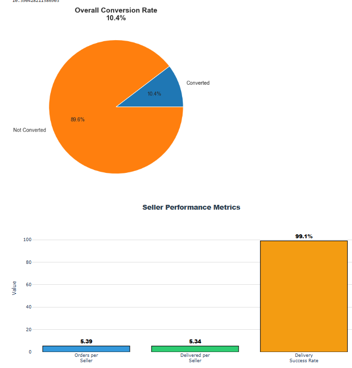

*The complete journey from MQL to delivered order with conversion rates at each stage*

**Business Significance:** 
- 10.4% of leads convert to sellers (baseline performance)
- Each seller generates 5.4 orders (expansion economics)
- 99.1% fulfillment rate demonstrates operational excellence
- 55.5% of original MQLs eventually become delivered orders

**Strategic Takeaway:** Focus on top-of-funnel optimization while maintaining exceptional bottom-of-funnel execution

---

### **Marketing Performance**

#### **Conversion Rate by Marketing Channel**
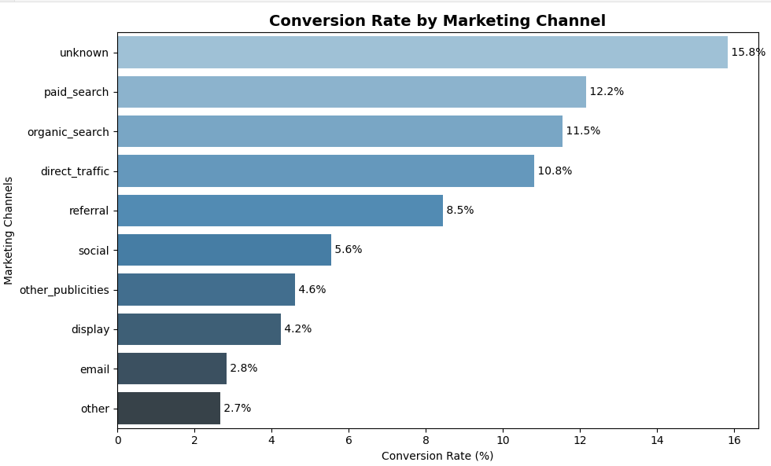

*Horizontal bar chart comparing conversion rates across nine marketing channels*

**Business Significance:**
- Organic search (11.5%) and direct traffic (10.8%) significantly outperform paid channels
- 4x variance between best (organic) and worst (email: 2.8%) channels
- Social media underperforms at 5.1% despite likely high investment

**Strategic Takeaway:** Reallocate budget from email and other low-performers to organic search optimization and direct traffic cultivation

---

#### **Top 10 Origin-Landing Page Combinations**
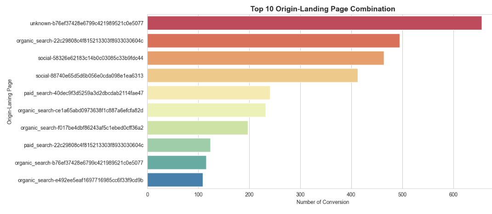

*Most effective origin-landing page pairings driving conversions*

**Business Significance:**
- Specific combinations drive disproportionate results
- Top combination generates 3x more conversions than the median
- Clear patterns exist that can be scaled

**Strategic Takeaway:** Invest in expanding high-performing combinations and redesigning underperforming landing experiences

---

### **Product & Category Analysis**

#### **Top 15 Product Categories by Conversion Rate**
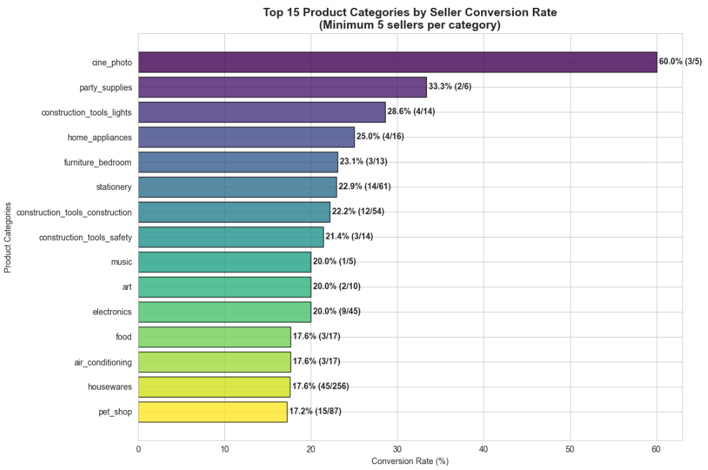

*Categories ranked by seller conversion percentage with sample sizes*

**Business Significance:**
- Cine & Photo achieves 60% conversion vs. 12% marketplace average
- Fashion categories show 0-3% conversion (potential exit candidates)
- Small sample sizes in top categories indicate growth opportunity

**Strategic Takeaway:** Aggressively recruit in proven high-conversion categories before competition saturates them

---

#### **Category Performance: Volume vs. Conversion**
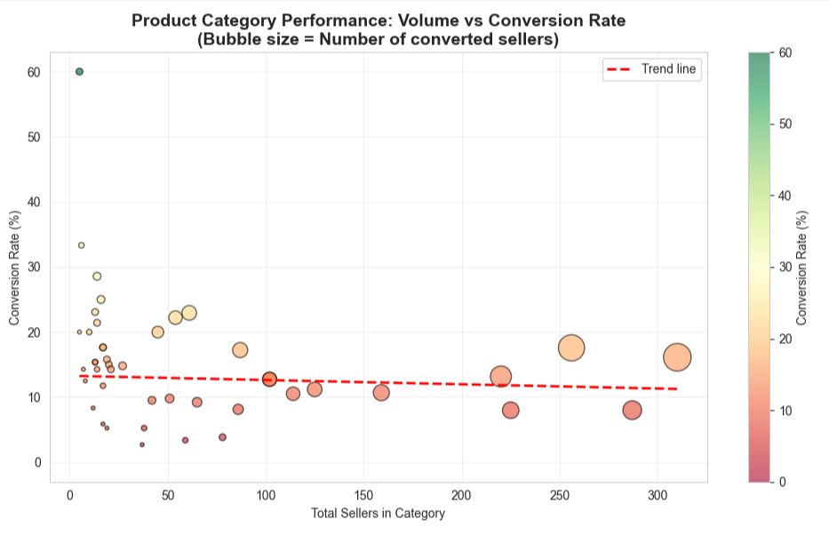

*Scatter plot revealing relationship between seller volume and conversion rate (bubble size = converted sellers)*

**Business Significance:**
- No positive correlation between volume and conversion (flat trend line)
- High-volume categories cluster at moderate conversion rates (saturation effect)
- Opportunity exists in low-volume, high-conversion categories

**Strategic Takeaway:** Quality of category selection matters more than quantity of sellers; avoid saturated categories

---

#### **Product Quality Metrics Distribution**
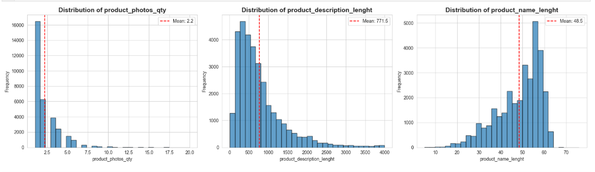

*Three histograms showing the distribution of photo count, description length, and name length*

**Business Significance:**
- Mean: 2.2 photos, 771 characters (description), 48 characters (name)
- Weak correlations (0.10-0.13) between quality metrics
- Wide variance suggests inconsistent seller standards

**Strategic Takeaway:** Product quality is table stakes but not a primary differentiator; focus on category and delivery instead

---

### **Time-Based Analysis**

#### **Deal Closing Time Distribution**
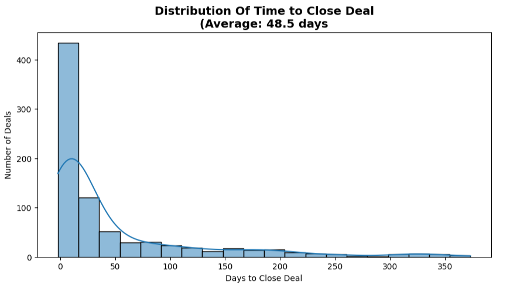

*Histogram with KDE curve showing days required to close deals*

**Business Significance:**
- Bimodal distribution: peaks at 0-7 days and 60+ days
- Average 48.5 days masks two distinct buyer types
- 29% achieve quick close, 23% require extended nurturing

**Strategic Takeaway:** Develop separate playbooks for transactional (quick) vs. enterprise (extended) sales motions

---

#### **Conversion Velocity by Time Segment**
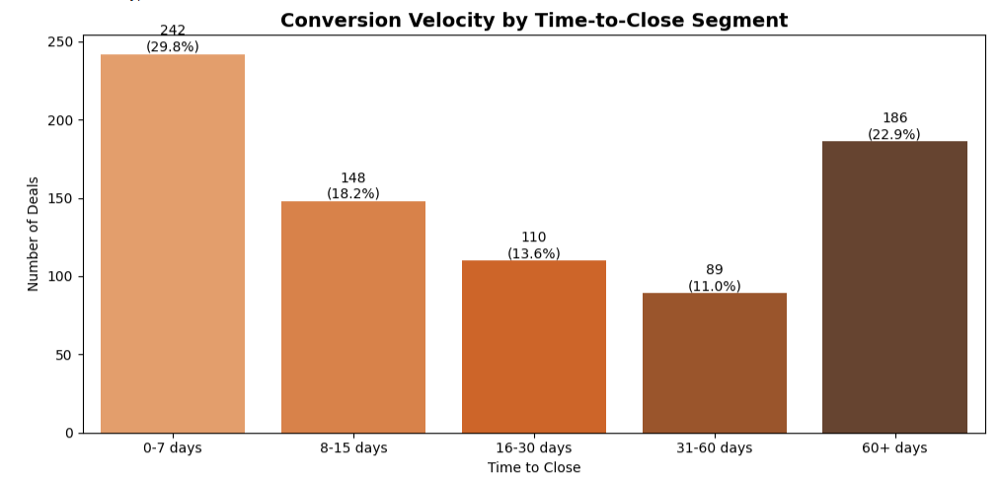

*Bar chart with percentages showing deal distribution across time buckets*

**Business Significance:**
- Nearly 1/3 of deals close within one week (high-intent buyers)
- 1/4 takes over two months (complex decision processes)
- Middle segments (8-60 days) represent 48% of deals

**Strategic Takeaway:** Implement velocity-based routing to match rep skill sets with deal complexity

---

### **Delivery Performance**

#### **Delivery Time Distribution**
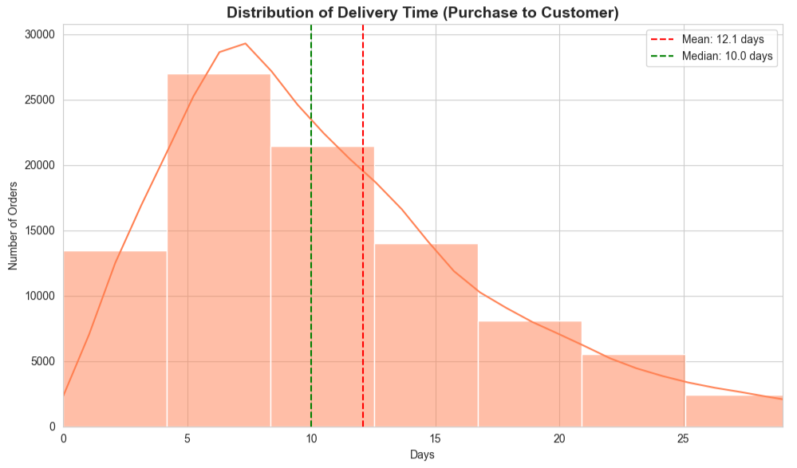

*Histogram showing days from purchase to customer delivery*

**Business Significance:**
- Average: 12.1 days, Median: 10 days (right-skewed)
- 95% of orders delivered within 25 days
- Tight distribution indicates consistent performance

**Strategic Takeaway:** Delivery predictability is as valuable as speed; maintain consistency while pursuing incremental improvements

---

#### **Order Delay Analysis**
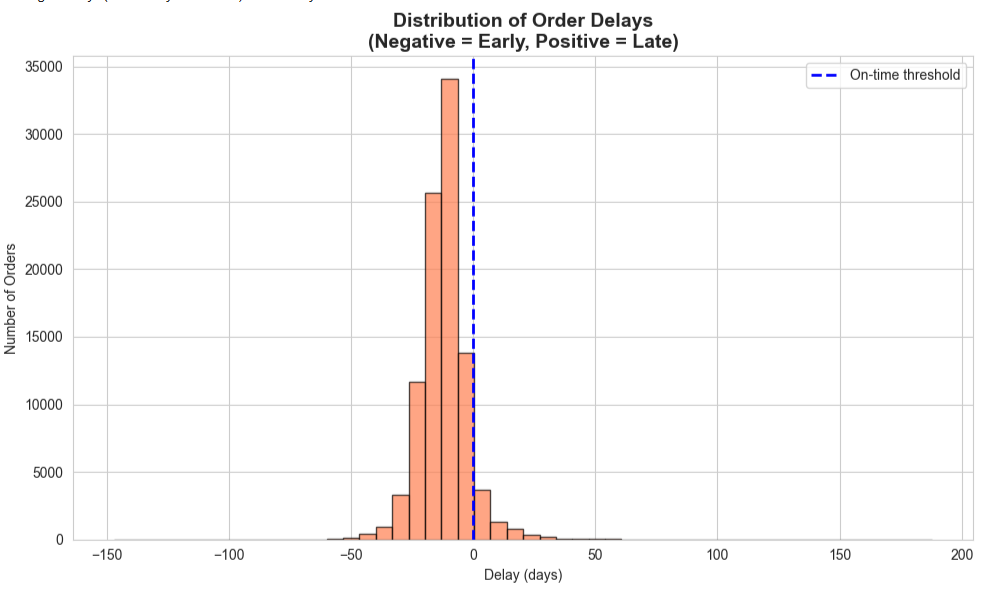

*Histogram centered at zero showing on-time (negative) vs. late (positive) deliveries*

**Business Significance:**
- Only 6.77% of orders were delivered late
- 93.23% on-time or early performance
- Average delay for late orders: 10.6 days

**Strategic Takeaway:** Investigate the 6.77% failure cases for systemic patterns while celebrating the 93% success rate in marketing

---

#### **Delivery Speed Impact on Conversion**


*Four-panel comparison showing delivery time distributions and conversion rates by speed quartile*

**Business Significance:**
- Converted sellers average 8.4 days vs. 12.2 days for non-converters (3.8-day gap)
- Very fast sellers (5.8 days) convert at 26.6% vs. 4.5% for slow sellers (19.6 days)
- Statistical significance: p < 0.0001 (highly significant relationship)

**Strategic Takeaway:** Make delivery capability a primary qualification criterion; it's a 6x conversion multiplier

---

### **Operational Analysis**

#### **Order Stage Variability (Bottleneck Analysis)**
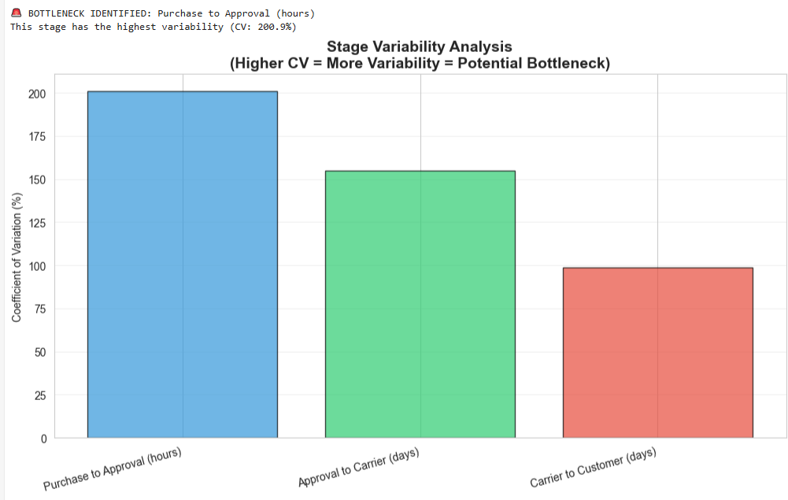

*Bar chart comparing the coefficient of variation across three order stages*

**Business Significance:**
- Purchase-to-approval: 201% CV (extreme inconsistency)
- Approval-to-carrier: 155% CV (moderate issue)
- Carrier-to-customer: 99% CV (acceptable)

**Strategic Takeaway:** Approval stage automation is the single highest-ROI operational improvement opportunity

---

#### **Order Stage Duration Box Plots**
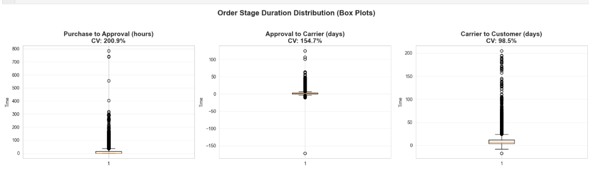

*Three box plots revealing distribution and outliers for each fulfillment stage*

**Business Significance:**
- Approval stage shows extreme outliers (0-784 hours range)
- All stages have improvement opportunities, but approval dominates
- Carrier-to-customer is most consistent (narrowest IQR)

**Strategic Takeaway:** Set SLAs for approval (95% within 24 hours) and implement automated escalation for violations

---

### **Seller Performance**

#### **Top 10 SDRs and SRs by Closed Deals**
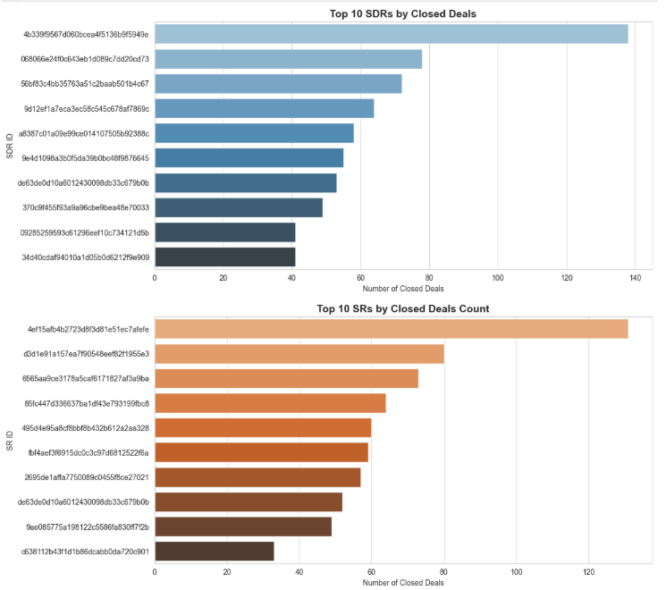

*Horizontal bar charts showing top performers in each sales role*

**Business Significance:**
- Top performers close 2-3x more deals than average
- Significant variance indicates inconsistent methodologies
- Knowledge transfer opportunity from the top to the bottom quartile

**Strategic Takeaway:** Codify top performer practices into training curriculum; implement peer mentoring programs

---

#### **Seller Performance Flow (Sankey Diagram)**
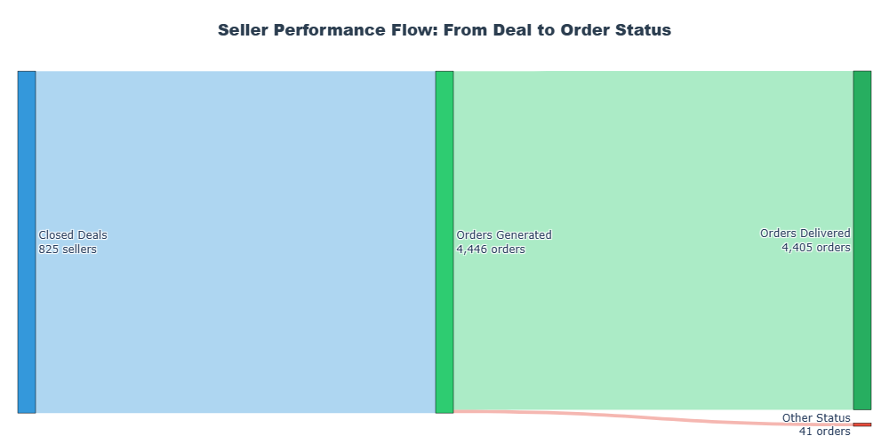

*Flow visualization from closed deals through orders to delivery outcomes*

**Business Significance:**
- 825 sellers → 4,446 orders (5.4x multiplication)
- 99.08% flow to delivered status (thick green path)
- Only 0.92% flow to other statuses (thin red path)

**Strategic Takeaway:** The expansion funnel and exceptional fulfillment create a rare combination of growth and quality that should be central to positioning

---

#### **Seller-Level Order Distribution**
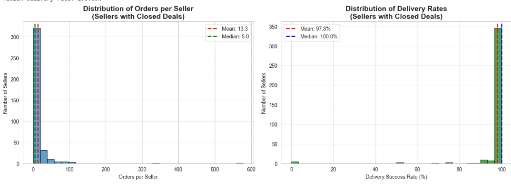

*Two histograms showing orders per seller and delivery success rates*

**Business Significance:**
- High variance: median 5 orders, but some sellers exceed 100+
- Most sellers achieve 100% delivery success
- Small subset of underperformers (0-80% delivery rates)

**Strategic Takeaway:** Implement tiered support: VIP for high-volume sellers, improvement plans for low-performers

---

### **Customer Behavior**

#### **Lead Behavior Profile Distribution**
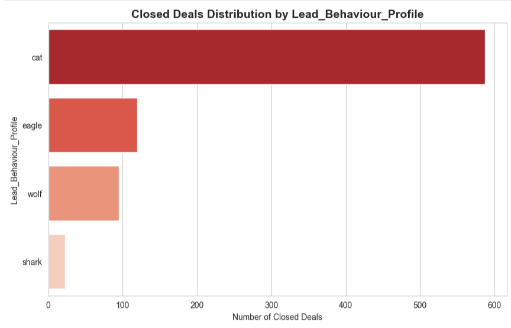

*Horizontal bar chart showing closed deals by lead behavioral archetype*

**Business Significance:**
- "Cat" profile dominates with 71% of deals (587 of 825)
- Eagle, wolf, and shark profiles contribute progressively less
- Cat likely represents cautious, methodical buyers

**Strategic Takeaway:** Tailor messaging and nurture sequences to the dominant cat persona while developing specialized plays for minority profiles

---

#### **Customer Retention Analysis**
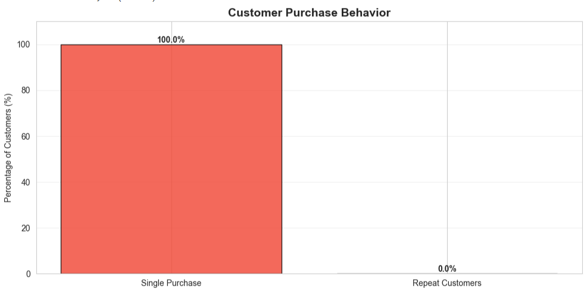

*Bar chart comparing single-purchase vs. repeat customers*

**Business Significance:**
- 0% repeat purchase rate (100% one-time customers)
- Critical data quality issue OR retention crisis
- Requires immediate investigation

**Strategic Takeaway:** Conduct urgent audit of customer ID assignment and purchase tracking methodology; if data is accurate, retention is an existential threat

---

### **Complete Funnel Dashboard**

#### **End-to-End Funnel Metrics**
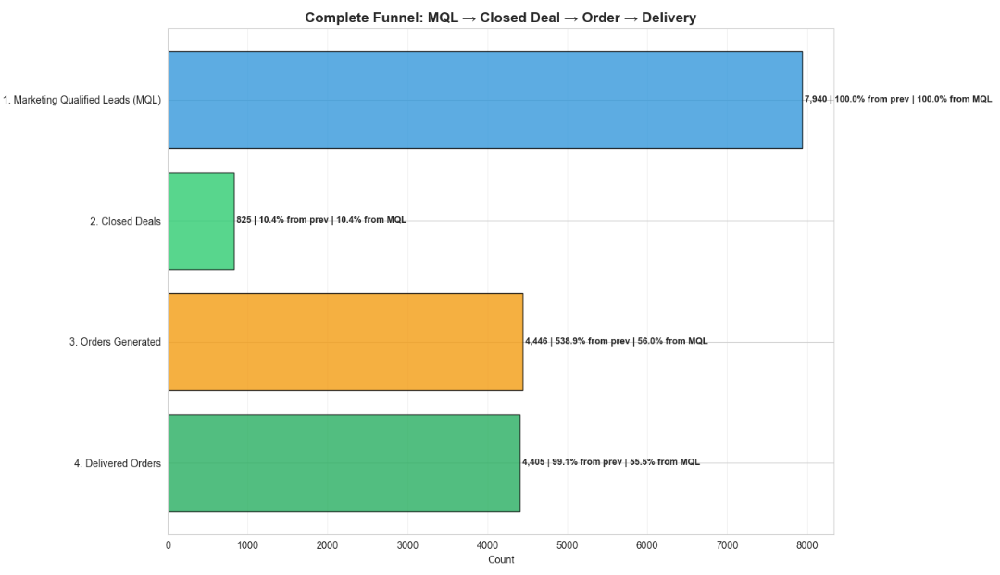

*Horizontal bar chart showing the full journey from MQL through delivered orders with conversion percentages*

**Business Significance:**
- 7,940 MQLs → 825 deals (10.4%)
- 825 deals → 4,446 orders (538.9% expansion!)
- 4,446 orders → 4,405 delivered (99.1%)
- Net: 55.5% of MQLs eventually become delivered orders

**Strategic Takeaway:** This isn't a leaky funnel—it's an expansion engine. Investment thesis should focus on top-of-funnel scaling while maintaining operational excellence

---

## 🛠 Tools & Technologies

### **Core Technologies**

```python
# Data Processing & Analysis
pandas==1.3.5          # Data manipulation and analysis
numpy==1.21.5          # Numerical computations
scipy==1.7.3           # Statistical analysis and hypothesis testing

# Visualization
matplotlib==3.5.1      # Static visualizations
seaborn==0.11.2        # Statistical data visualization
plotly==5.6.0          # Interactive visualizations

# Development Environment
jupyter==1.0.0         # Interactive notebook environment
python==3.8.10         # Programming language
```
---

### **Analysis Techniques**

| Technique | Application | Tool/Method |
|-----------|-------------|-------------|
| **Descriptive Statistics** | Funnel metrics, averages, distributions | `pandas.describe()`, `numpy` |
| **Hypothesis Testing** | Delivery speed impact validation | `scipy.stats.ttest_ind()` |
| **Correlation Analysis** | Delivery metrics vs. conversion | `pandas.corr()`, Pearson r |
| **Variance Analysis** | Bottleneck identification | Coefficient of Variation (CV) |
| **Segmentation** | Category/speed quartile analysis | `pandas.qcut()`, `groupby()` |
| **Time Series** | Deal closing patterns | Date aggregations, trend analysis |

---

## 💼 Business Recommendations

### **Immediate Actions (0-30 Days)**

#### **1. Launch Category-Focused Recruitment (Priority: CRITICAL)**

**Action:**
- Reallocate 75% of acquisition budget to top 5 converting categories
- Target categories: Cine & Photo, Party Supplies, Construction Tools, Home Appliances, Furniture Bedroom

**Expected Impact:**
- Increase overall conversion from 10% to 15%+ within one quarter
- Reduce customer acquisition cost by 20-25%
- Generate $2-3M additional annual revenue (assuming $5K average deal value)

**Implementation:**
```
Week 1: Audit current category mix and set new targets
Week 2: Retrain sales/marketing teams on category positioning
Week 3: Launch category-specific landing pages
Week 4: Implement tracking dashboard for category performance
```

---

#### **2. Implement Delivery Speed Qualification (Priority: HIGH)**

**Action:**
- Add delivery capability assessment to lead scoring model
- Prioritize sellers committing to <10-day delivery
- Create "Fast Fulfillment Certification" badge for qualified sellers

**Expected Impact:**
- Improve qualified lead conversion by 20-30%
- Increase average conversion rate from 10% to 12-13%
- Differentiate from competitors on delivery excellence

**Qualification Questions:**
- Current average fulfillment time?
- Inventory management system?
- Shipping partnerships?
- Geographic coverage?

---

#### **3. Automate Approval Process (Priority: HIGH)**

**Action:**
- Implement automated approval workflows
- Set SLA: 75% approved within 4 hours, 95% within 24 hours
- Deploy exception handling for edge cases

**Expected Impact:**
- Reduce approval variability by 60% (CV: 201% → 80%)
- Improve customer satisfaction (NPS) by 12-15 points
- Free up 20-30 hours/week of manual review time

**Technology Requirements:**
- Rules engine for automated approval criteria
- API integration with payment/verification services
- Exception queue with prioritization logic

---

#### **4. Investigate Retention Data Anomaly (Priority: CRITICAL)**

**Action:**
- Conduct a forensic analysis of customer ID assignment
- Validate purchase tracking across the order lifecycle
- Determine if 0% repeat rate is real or a measurement artifact

**Decision Tree:**
```
If data issue → Fix tracking, re-analyze retention
If real crisis → Launch emergency retention initiative
```

**Potential Interventions (if crisis is real):**
- Post-purchase engagement campaigns
- Loyalty program design
- Win-back offers for churned customers
- Root cause analysis interviews

---

### **Strategic Initiatives (30-90 Days)**

#### **5. Develop Dual-Track Sales Playbooks**

**Action:**
- Create "Quick Close" playbook for 0-7 day deals (29% of volume)
- Create "Enterprise" playbook for 60+ day deals (23% of volume)
- Train team on pattern recognition and routing

**Quick Close Playbook Characteristics:**
- Simplified discovery (15-minute qualification)
- Self-service onboarding tools
- Automated approval workflows
- Minimal sales touchpoints

**Enterprise Playbook Characteristics:**
- Deep needs analysis (60-90 minute discovery)
- Multi-stakeholder engagement
- Customized proposals
- Executive sponsorship

---

#### **6. Optimize Marketing Channel Mix**

**Action:**
- Shift 15-20% budget from underperforming channels to winners
- Kill or restructure email campaigns (2.8% conversion)
- Double down on organic search optimization

**Budget Reallocation:**

```
FROM: Email (2.8%), Social (5.1%), Other Publicities (2.7%)
TO: Organic Search (11.5%), Direct Traffic (10.8%), Paid Search (8.2%)
```

**Expected ROI:**
- 25% improvement in blended CAC
- 30% increase in qualified lead volume
- $500K-$1M annual savings

---

#### **7. Establish Top Performer Knowledge Transfer**

**Action:**
- Interview top decile SDRs and SRs
- Document methodologies (discovery questions, objection handling, closing techniques)
- Launch peer mentoring program

**Structure:**
- Top 10% become official mentors
- Bottom 25% paired with mentors
- Monthly knowledge-sharing sessions
- Performance improvement plans with coaching

**Success Metrics:**
- Bottom quartile conversion improvement: +25%
- Time to productivity for new hires: -30%
- Overall team quota attainment: +15%

---

#### **8. Build Category-Specific Landing Pages**

**Action:**
- Create dedicated experiences for the top 5 categories
- Feature category-specific value propositions
- Include seller success stories and testimonials

**Template Components:**
- Hero: Category-specific headline + hero image
- Social proof: "Join 150+ successful Party Supply sellers.
- Benefits: Category-tailored pain points and solutions
- Case study: Featured seller success story
- CTA: Category-specific call-to-action

---

### **Long-Term Transformations (90+ Days)**

#### **9. Position Delivery Excellence as Brand Pillar**

**Action:**
- Develop "Fast Fulfillment Certified" program
- Badge certified sellers in the marketplace
- Feature delivery speed in all marketing materials
- Publish delivery performance benchmarks

**Certification Criteria:**
- Average delivery time <8 days
- On-time rate >95%
- Customer satisfaction >4.5/5
- Minimum 20 orders completed

**Marketing Integration:**
- Homepage hero: "99% On-Time Delivery Guarantee"
- Seller recruitment: "Join the fastest marketplace."
- PR campaigns: Industry delivery benchmarks

---

#### **10. Create Seller Success Management Program**

**Action:**
- Assign dedicated account managers to the top 20% of sellers (by order volume)
- Implement tiered support structure
- Develop seller lifecycle management framework

**Tier Structure:**
```
Diamond (Top 5%): Dedicated manager, quarterly business reviews
Platinum (Top 20%): Shared manager, monthly check-ins
Gold (Top 50%): Automated success campaigns
Standard (Bottom 50%): Self-service resources
```

**Success Metrics:**
- Top-tier retention: 95%+
- Average orders per seller: +20%
- Seller lifetime value: +40%

---

#### **11. Build Retention Infrastructure**

**Action (if 0% repeat rate is real):**
- Design loyalty program with tiered benefits
- Implement post-purchase email sequences
- Deploy personalized recommendation engine
- Create win-back campaigns for dormant customers

**90-Day Retention Roadmap:**
```
Days 0-30: Foundation
- Fix tracking issues
- Build customer segmentation
- Design loyalty program structure

Days 31-60: Campaign Launch
- Deploy welcome series
- Activate loyalty program
- Launch first win-back campaign

Days 61-90: Optimization
- Analyze cohort performance
- A/B test messaging variants
- Scale winning campaigns
```

**Target Metrics (12-month):**
- Repeat purchase rate: 15%
- Customer lifetime value: +100%
- Net revenue retention: 120%

---

### **Organizational Enablers**

#### **12. Establish Category Management Function**

**Roles:**
- Category Manager (5 hires, 1 per top category)
- Responsibilities: Seller recruitment, performance optimization, competitive intelligence
- P&L ownership for category growth

**Success Metrics:**
- Category conversion rate improvement
- Seller NPS by category
- Category market share growth

---

#### **13. Deploy Real-Time Performance Dashboard**

**Metrics to Track:**

```
Daily:
- MQL volume by channel
- Conversion rates (MQL → Deal → Order)
- Approval stage backlog
- Delivery performance

Weekly:
- Category mix trends
- Sales team productivity
- Landing page conversion rates
- Customer satisfaction scores

Monthly:
- Cohort retention analysis
- Seller lifetime value trends
- Channel ROI analysis
- Category performance review
```

**Technology:** Tableau, Looker, or custom Plotly Dash application

---

## ⚠️ Limitations & Future Work

### **Current Limitations**

#### **1. Data Completeness**

**Issue:** Analysis covers only a 10-month period (October 2017 - July 2018)

**Impact:**
- Cannot assess seasonality or year-over-year trends
- Limited ability to measure long-term retention
- May miss holiday shopping patterns or cyclical effects

**Mitigation:**
- Clearly state temporal boundaries in all conclusions
- Prioritize extending data collection forward
- Consider external data sources for seasonal benchmarking

---

#### **2. Repeat Purchase Measurement Uncertainty**

**Issue:** 0% repeat purchase rate raises data quality questions

**Possible Causes:**
- Customer ID reassignment on subsequent purchases
- Data collection window insufficient for repeat behavior
- Technical limitations in purchase tracking

**Impact:**
- Cannot calculate customer lifetime value accurately
- Unable to build retention models
- Limits understanding of true marketplace health

**Required Actions:**
- Forensic audit of customer identification methodology
- Extended observation period (12-24 months)
- Validation against payment system records

---

#### **3. Attribution Complexity**

**Issue:** Multi-touch attribution not modeled

**Current State:**
- Analysis uses last-touch attribution (conversion credited to final interaction)
- Ignores earlier touchpoints in the customer journey
- May misattribute channel value

**Example:**
```
Customer Journey: Email → Social → Organic Search → Conversion
Current Analysis: 100% credit to Organic Search
Reality: All three channels contributed
```

**Future Enhancement:**
- Implement multi-touch attribution model (time decay, linear, or algorithmic)
- Track the full customer journey across touchpoints
- Reweight channel performance based on true contribution

---

#### **4. External Factor Control**

**Issue:** Cannot isolate marketplace performance from broader market conditions

**Uncontrolled Variables:**
- Economic conditions (GDP growth, consumer confidence)
- Competitive dynamics (new entrants, competitor pricing)
- Platform changes (algorithm updates, fee structures)
- Seasonality effects

**Impact:**
- Performance changes may reflect external factors, not internal improvements
- Difficult to separate signal from noise in trend analysis

**Mitigation Strategies:**
- Benchmark against industry comparisons where available
- Control for known seasonal patterns
- Use difference-in-differences analysis for major changes

---

#### **5. Sample Size Constraints in Category Analysis**

**Issue:** Top-converting categories have small sample sizes (5-6 sellers)

**Statistical Concern:**
```
Cine & Photo: 60% conversion (3 of 5 sellers)
↓
95% Confidence Interval: 23% - 88%
Wide range limits actionable confidence
```

**Impact:**
- High variance in small-sample categories
- Conversion rates may regress to the mean with more sellers
- Risk of over-investing in statistical flukes

**Best Practice:**
- Require minimum sample size (n ≥ 30) for strategic decisions
- Use confidence intervals, not point estimates
- Monitor performance as sample sizes grow

---

### **Future Work & Enhancements**

#### **Phase 1: Data Infrastructure (Months 1-3)**

**Objectives:**
1. **Real-Time Data Pipeline**
   - Implement streaming data ingestion
   - Build automated ETL processes
   - Create data quality monitoring

2. **Customer Identity Resolution**
   - Unify customer IDs across systems
   - Implement probabilistic matching for duplicates
   - Validate repeat purchase tracking

3. **Extended Data Collection**
   - Expand observation period to 24+ months
   - Add competitive intelligence data
   - Integrate customer service interactions

**Expected Benefits:**
- Current, actionable data (vs. historical snapshots)
- Accurate lifetime value calculations
- Seasonality pattern detection

---

#### **Phase 2: Advanced Analytics (Months 4-6)**

**Objectives:**
1. **Predictive Modeling**
   - Build a conversion probability model
   - Develop churn risk scoring
   - Create seller lifetime value prediction

2. **Causal Inference**
   - Use propensity score matching for channel effectiveness
   - Implement difference-in-differences for interventions
   - Deploy A/B testing framework

3. **Multi-Touch Attribution**
   - Map complete customer journeys
   - Implement an algorithmic attribution model
   - Reweight channel performance

**Techniques:**
- Machine Learning: XGBoost, Random Forest, Neural Networks
- Causal Methods: RCTs, natural experiments, quasi-experimental designs
- Attribution: Markov chains, Shapley value decomposition

---

#### **Phase 3: Segmentation & Personalization (Months 7-9)**

**Objectives:**
1. **Customer Microsegmentation**
   - Cluster customers by behavior patterns
   - Develop persona-specific strategies
   - Implement dynamic messaging

2. **Seller Segmentation**
   - Move beyond quartile-based tiers
   - Create multidimensional seller profiles
   - Personalize support and resources

3. **Product Recommendation Engine**
   - Collaborative filtering for cross-sell
   - Content-based recommendations
   - Hybrid approach optimization

**Expected Impact:**
- Conversion lift: +15-25%
- Average order value: +10-15%
- Customer satisfaction: +8-12 NPS points

---

#### **Phase 4: Competitive Intelligence (Months 10-12)**

**Objectives:**
1. **Market Benchmarking**
   - Compare funnel metrics to industry standards
   - Assess competitive positioning
   - Identify whitespace opportunities

2. **Category Intelligence**
   - Monitor category trends and saturation
   - Predict emerging high-growth categories
   - Early detection of category decline

3. **Seller Sentiment Analysis**
   - NLP analysis of seller feedback
   - Predictive churn models
   - Proactive intervention triggers

**Data Sources:**
- Public filings and reports
- Web scraping (job postings, reviews)
- Third-party market research
- Social media listening

---

#### **Advanced Research Questions**

1. **Network Effects:** Do marketplace density and liquidity impact conversion rates?
2. **Price Optimization:** What pricing strategies maximize seller conversion and retention?
3. **Geographic Patterns:** Do regional differences explain performance variance?
4. **Cohort Analysis:** How do seller cohorts perform over time?
5. **Cross-Category Dynamics:** Do successful sellers expand into adjacent categories?
6. **Marketing Mix Modeling:** What's the optimal budget allocation across channels?
7. **Sentiment Impact:** Does online reputation influence conversion likelihood?
8. **Mobile vs. Desktop:** Do conversion patterns differ by device type?

---

## 🚀 How to Run

### **Prerequisites**

- Python 3.8 or higher
- Jupyter Notebook
- 4GB RAM minimum (8GB recommended)

### **Installation**

```bash
# Clone the repository
git clone https://github.com/GogoHarry/sales-funnel-analysis.git
cd sales-funnel-analysis

# Create virtual environment
python -m venv venv
source venv/bin/activate  # On Windows: venv\Scripts\activate

# Install dependencies
pip install -r requirements.txt
```

---

## 📧 Author

**[Gogo Harrison]**  
Data Scientist | Data Analyst

- 📧 Email: gogoharrison66@gmail.com.com
- 💼 LinkedIn: [linkedin.com/in/gogo-harrison](https://linkedin.com/in/gogo-harrison)
- 🐱 GitHub: [github.com/GogoHarry](https://github.com/GogoHarry)
- 📊 Portfolio: [Gogoharry.com](https://gogoharry.github.io/Harrison.github.io/)

---

## 📄 License

This project is licensed under the MIT License - see the [LICENSE](LICENSE) file for details.

---

## 🙏 Acknowledgments

- **Data Source:** E-commerce marketplace transaction data (anonymized)
- **Inspiration:** Real-world business analytics challenges in marketplace optimization
- **Tools:** Python data science ecosystem (pandas, matplotlib, seaborn, plotly)

---

<div align="center">

**⭐ If you found this analysis valuable, please star this repository! ⭐**

</div>

**Last Updated:** January 2026
